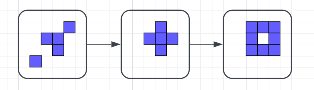

# 🧬 Game of Life

Acest proiect reprezintă o implementare în limbajul C a jocului **Conway's Game of Life**, realizată în cadrul cursului **Proiectarea Algoritmilor**. Proiectul este structurat în trei taskuri, fiecare adăugând o complexitate nouă asupra simulării automate a evoluției unei populații celulare.

Game of Life este un ‘joc’ care demonstrează cum, printr-un set de reguli simple, se
pot genera comportamente complexe. Nu este propriu-zis un joc, ci un automat celular,
adică un model matematic ce descrie funct, ionarea sistemelor de calcul (hardware sau
software). A fost creat de matematicianul John Conway.
Game of Life se desfăs,oară pe o grilă de celule pătrate, în care fiecare celulă poate avea
două stări: vie sau moartă. Celulele interact, ionează, de la un moment de timp la altul
(denumite generat, ii), cu cele 8 celule vecine, după următoarele reguli:
1. Orice celulă vie cu mai put, in de doi vecini în viat,ă moare (subpopulare).
2. Orice celulă vie cu doi sau trei vecini vii trăies, te în continuare.
3. Orice celulă vie cu mai mult de trei vecini vii moare (suprapopulare).
4. Orice celulă moartă cu exact trei vecini devine o celulă vie (reproducere).

 

## 📌 Taskuri implementate

### ✅ Task 1 – Simulare Game of Life
- Se citește o matrice cu dimensiunile și configurația inițială.
- Se aplică regulile standard Game of Life timp de `K` generații.
- Se scrie în fișier rezultatul fiecărei generații.

### ✅ Task 2 – Stivă de diferențe
- În loc să păstreze toate matricile, se rețin doar celulele care s-au modificat între generații.
- Diferențele sunt stocate într-o **stivă de liste**.
- La final, se afișează coordonatele celulelor modificate pentru fiecare generație.

### ✅ Task 3 – Arbore binar de generații
- Se creează un **arbore binar** în care fiecare nod este o generație.
- Fiecare nod generează:
  - Fiul stâng: după o regulă alternativă (B)
  - Fiul drept: după regula standard (S)
- Se parcurge arborele în **preordine**, iar fiecare matrice este scrisă în fișier.

### ▶️ Cum compilezi și rulezi
1. Compilează

gcc proiect.c -o proiect

2. Rulează

./proiect

### 📥 Format fișier in.txt

<tp> <nl> <nc> <ng>
<linie 1>
<linie 2>
...
<linie n>

unde:
- tp – tipul taskului (1, 2 sau 3)

- nl, nc – număr de linii și coloane

- ng – număr de generații

- + = celulă moartă, X = celulă vie

